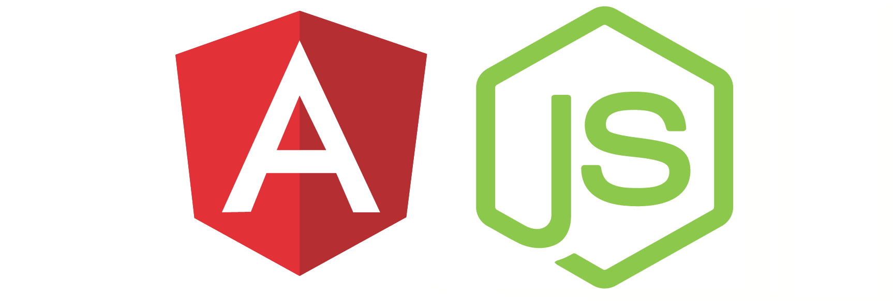

# BarterAPP

Multiplatform's app for manage business time.

## Getting Started

Please follow the instructions. You can access the app in your favourite brownser. Also you can downloading in your favourite smartphone.

### Prerequisites

A device with IOS, Android or Windows Phone. A Computer with internet access.

## Deployment

....

## Built With

Some of the open source technologies used in this application are:

* [Angular2](https://angular.io/) - Web framework
* [Ionic](https://ionicframework.com/) - Web framework
* [NodeJS](https://nodejs.org//) - API
* [Express](https://expressframework.com/) - Web framework
* [PassportJS](http://passportjs.org/) - Web framework
* [Express](https://expressframework.com/) - Web framework
* [Angular CLI](https://cli.angular.io/) - Tools
* [Angular Material2](https://material.angular.io/) - Tools

## Contributing

Please read [CONTRIBUTING.md](https://gist.github.com/PurpleBooth/b24679402957c63ec426) for details on our code of conduct, and the process for submitting pull requests to us.

## Versioning

Version 1.0

## Authors

* **A. Aguado** - *Main Work* - [Personal Website](https://about.me/aaguado)
* **Luis R.Izquierdo** - *Main Idea* - [Personal Website](http://www.luis.izqui.org/)

## License

This project is licensed under Attribution-NonCommercial
CC BY-NC - see the [Creative Commons site](https://creativecommons.org/licenses/by-nc/4.0/legalcode) for details

## Acknowledgments

Thank you.

## Notes

This page is under construction, please be patient and return in few months
